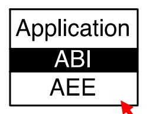
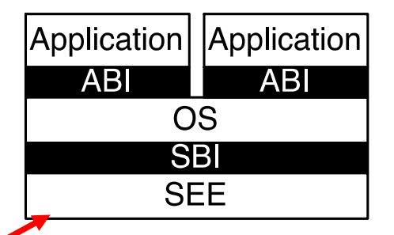
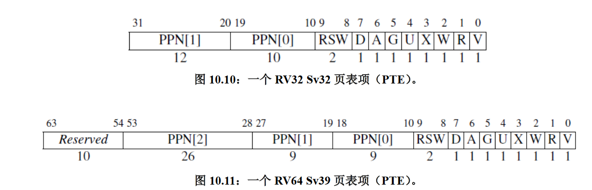
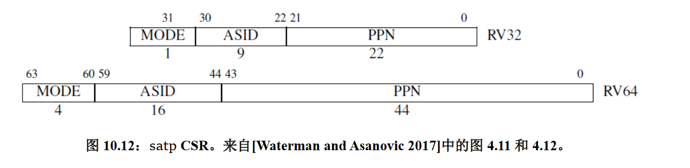
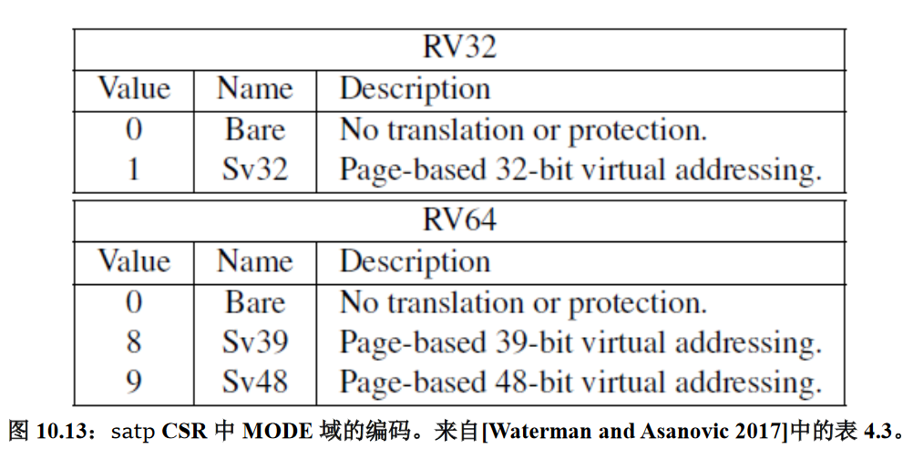

# RISC-V PPT总结

## 特权级架构层次划分

+ 裸机上运行程序，如单片机、嵌入式系统。此场景只需要两个特权级，两个特权级通过ABI接口进行隔离。
  

+ 操作系统运行程序，如PC。在这种场景下，需要三个特权级，App和OS之间通过ABI进行交互，OS和机器硬件之间通过SBI进行交互

## 特权模式
+ User (U Mode) 最低特权级 平时可以称作 用户态
+ Supervisor (S Mode) 中等特权级 平时可以称作监管者模式、内核态、特权态等。
+ Machine （M-Mode） 最高特权级 通常称作机器态

常见特权态组合：

+  M：最简单的单片机嵌入式系统，代码就在最高权限跑就行，应用层的代码就对整个CPU享有完全的控制权，成本最低。无内存保护，直接操作内存地址，没有安全保障。
+  M + U：相比于第一种，增加了内存保护功能。在这类CPU上，就可以让操作系统运行在M态，用户程序运行在U态，把操作系统所在的程序段、以及使用到的内存段，通过内存保护机制限制U态用户程序的访问。这种处理器上的操作系统，既可以实现任务的调度，也可以保证在用户程序干坏事的时候内核自己不受影响。
+  M+S+U：相比于前两种，这一种引入了S态，而S态很重要的一个作用就是引入了页表，从而可以实现虚拟内存相关的一系列高端功能。也就是说支持这三个特权态的处理器都是配备有MMU的，因此也就可以跑类Unix操作系统了。

更高级别特权模式相比如低级别主要强在：

+ 更高的特权级可以执行更多的指令，而低特权级不能执行这些指令
+ 更高的特权级可以操作更多的CSR（Control/Status Register）

## 各特权指令

1. 各个特权级都拥有的指令（也就是最小子集）：   
    +  ECALL 主要用于特权态切换，通常的用法是在U态调用ECALL来陷入S态，在S态调用ECALL来陷入M态。（不过为了实现这种陷入关系，需要有额外的配置，下文会说明）
    +  EBREAK 产生断点异常，对于程序调试有帮助
    + FENCE.I 产生一个内存读写屏障
    + SRET 从S态返回U态（只有在支持S态的CPU上才可以）

2. S 态引入的指令：
SFENCE.VMA 主要的作用是刷页表
3. M 态引入的指令：
WFI： 让当前处理器核心进入睡眠状态

## 各特权CSR

+ CSR寄存器有自己的一套独立的地址空间，并且访问CSR需要使用专用的指令。
+ 每一个处理器核心都有自己一套独立的4K CSR, 这4K CSR分别对应到4个特权态（U\S\M是我们之前提到的三个，第四个和虚拟化有关）所以对于每一个特权态，最多有1024个CSR可以使用。
+ 访问没有权限的CSR会Trap，访问不存在的CSR会Trap，写只读的CSR会Trap，对于可选寄存器的操作会被忽略

## 内存地址翻译：虚拟内存

+ 最小的页大小是4kB
+ 有多种地址映射的方式（Sv32、Sv39、Sv48等）， 我们实验要用到的是Sv39，也就是说我们的虚拟地址空间由39bit的地址组成，可以寻址512GB的地址空间。

## RISC-V 页表项

+ 对于32位宽的处理器，如果开启了虚拟内存，那么只有32bit位宽的虚拟地址空间可以选。
+ 对于64位宽的处理器，选择就很多了，如果开启虚拟内存的话，也有Sv39、Sv48、Sv57等几种不同的虚拟地址方案，分别表示虚拟地址的位宽是39bit,48bit,57bit。

页表是以一棵树的形式来存储的,那么一棵树必然要有一个树根，这个树根所在的位置，就要存放在stap这个寄存器中。

stap寄存器的PPN字段记录了页表根节点的位置，在32位架构上，MODE字段只能取0、1两个值，分别代表关闭或者开启地址映射。在64位架构上，MODE可选的取值很多，这里只列出了其中的3种，0表示不开启转换。

## 内存屏障

S特权态引入了一个名为SFENCE.VMA的指令，这个命令是用来刷新页表缓存(TLB)的。这里需要注意一点的是，这个刷新操作只在当前的处理器核心上起作用，如果是多核环境，则需要通过核间通信的方式让其他内核也进行刷新。不过实验不涉及到多核。

## 内存保护

RISC-V有两种内存保护机制：
+ 如果处理器支持并开启的内存地址转换（也就是用了页表），那么可以通过页表项里面的权限位来控制每个内存页的访问权限。（实验中会涉及到相关的操作）
+ 如果处理器不支持S特权态（比较简单廉价的处理器），他可能支持物理内存保护单元（PMP），RISC-V的内存保护单元最多支持保护16片内存区域，也就是说你可以为最多16片内存区域设置各自不同的访问权限。（但是很多嵌入式处理器可能只支持4个或8个保护区）
+ 如果同时启用了虚拟内存和物理内存保护单元，那么虚拟内存权限控制优先于PMP

##  中断与异常

+ 异常：同步事件，发生的原因是明确的（由具体的某一条指令而导致的）
+ 中断：异步事件，并不是因为某一条指令的执行而造成的，是外部事件造成的
+ 中断和异常的处理流程“几乎”是一样的

和异常处理有关的CSR：
+ stvec、mtvec(Trap-Vector Base-Address Register): 用于设置事件发生以后的处理函数地址。事件发生以后会跳转到这里所设置的地址上面去执行处理函数。
  + 发生事件时的跳转策略有两种，一种是无论什么事件都跳转到同一个固定的位置去执行处理函数，另一种是通过向量表，根据不同的事件类型跳转到不同的地址去执行不同的处理函数，rCore实验里面用的是第一种。
+ medeleg、mideleg(Trap Delegation Registers)：用来决定发生事件时进入哪个特权级来处理事件，详见下一页PPT

+ scause、mcause（Cause Register）：用于存储事件发生原因的ID，最高位是1表示这是一个中断，最高位是0表示这是异常。

+ stval、mtval（Trap Value Register）: 用于存储与事件相关的额外信息，比如可能是非法地址、非法操作数等，具体可以参考官方规范文档。

+ sepc、mepc (Exception Program Counter)：用于存储从高特权态返回到低特权态时，要回到的地址

+ mstatus、sstatus(Status Register): 用于记录一些常用的标志位

## Trap的代理机制

通常状态下，事件发生时都是直接陷入到最高特权级的M态，但是很多时候没必要直接上报到最高领导那里去对吧，通常的思路是，U态遇到处理不了的问题了，就抛给S态去处理，S态要是还处理不了，再找M态去解决。

回忆一下在本文很靠前的位置，我们提到了ECALL指令用于在特权态之间切换，通常情况下，一般默认调用ECALL的时候，都是无条件转到M态的，但是通过设置medeleg、mideleg两个寄存器，可以实现在U态执行ECALL的时候进入S态，在S态执行ECALL的时候进入M态。

